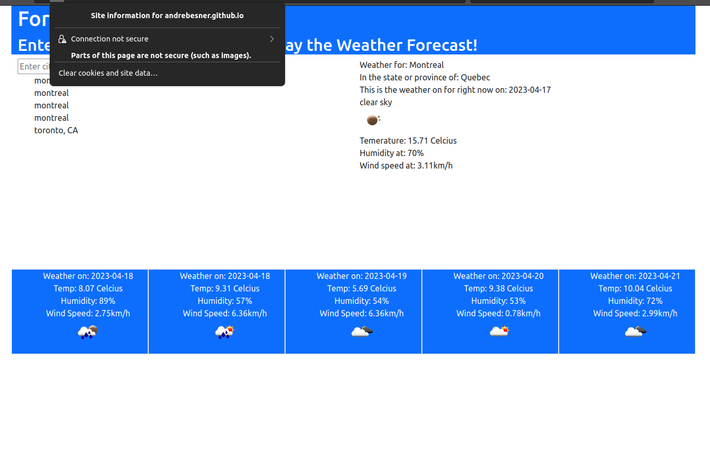

# Challenge 6 - 5 Day Weather Forecast

## Description

This program was written in order to further one's understanding of server-side API calls.

By using the wonderful API's provided by open weather, I was able to convert a cities written name

into usable data to display a 5 day forecast.

## Installation

No additional steps required to install. Just navigate to page. It has been tested functional

on current versions of Google Chrome and Firefox as of April 16, 2023. See usage for notes on firefox systems

https://andrebesner.github.io/challenge-6-weather-forecast/

## Usage

When you first run site on firefox it may give you mixed content error. To get site working you need to click security options and temp disable that security. You don't need to do this for chrome.

Use the site however you like. As stated in the text input box, you can add a comma and country code

to a city in order to narrow it down more. Ex there is a difference between searching "Whitby" and "Whitby, CA"

## Credits

This project could have never been deployed without the help of the fantastic bootcamp instructors, Adam Nym and Daler Singh.

Understanding parts of code was achieved using OpenAI's ChatGPT
https://chat.openai.com/

Tutorials provided by W3 schools and Mozilla MDN Docs also used:
https://www.w3schools.com/
https://developer.mozilla.org/en-US/

## License

MIT License

Copyright (c) 2023 Andre Besner

Permission is hereby granted, free of charge, to any person obtaining a copy
of this software and associated documentation files (the "Software"), to deal
in the Software without restriction, including without limitation the rights
to use, copy, modify, merge, publish, distribute, sublicense, and/or sell
copies of the Software, and to permit persons to whom the Software is
furnished to do so, subject to the following conditions:

The above copyright notice and this permission notice shall be included in all
copies or substantial portions of the Software.

THE SOFTWARE IS PROVIDED "AS IS", WITHOUT WARRANTY OF ANY KIND, EXPRESS OR
IMPLIED, INCLUDING BUT NOT LIMITED TO THE WARRANTIES OF MERCHANTABILITY,
FITNESS FOR A PARTICULAR PURPOSE AND NONINFRINGEMENT. IN NO EVENT SHALL THE
AUTHORS OR COPYRIGHT HOLDERS BE LIABLE FOR ANY CLAIM, DAMAGES OR OTHER
LIABILITY, WHETHER IN AN ACTION OF CONTRACT, TORT OR OTHERWISE, ARISING FROM,
OUT OF OR IN CONNECTION WITH THE SOFTWARE OR THE USE OR OTHER DEALINGS IN THE
SOFTWARE.

## How to Contribute

Do literally whatever you want with the site and the code. Try and break it and tell me how you did it.

## End

Thanks for making it to the end of the readme!